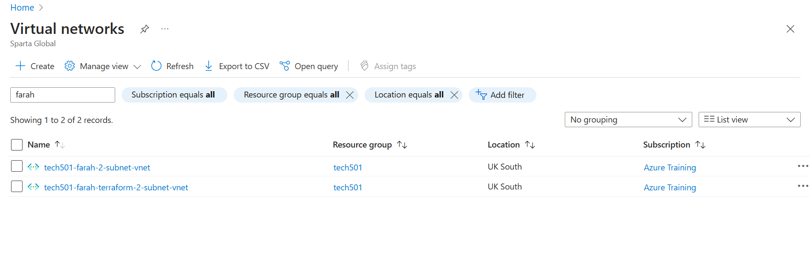
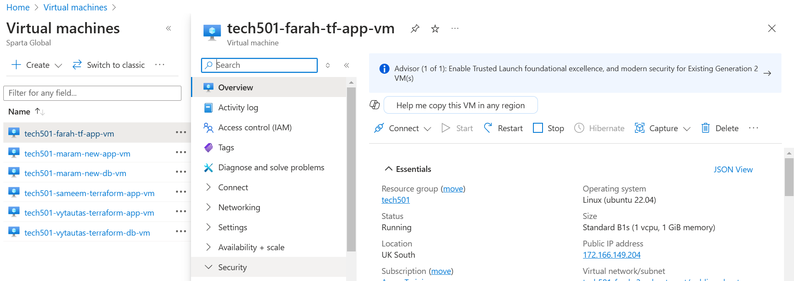
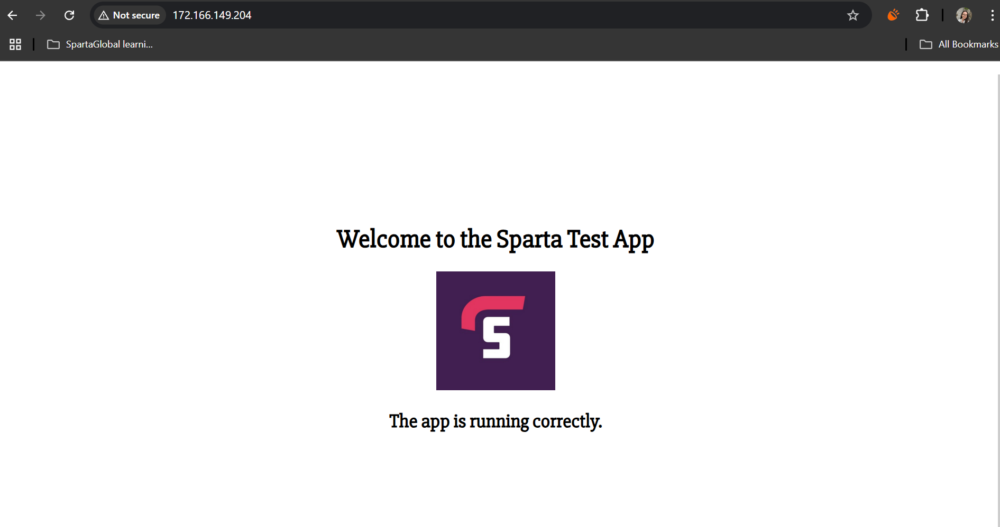

# Steps

- [Steps](#steps)
  - [Setting up Azure CLI](#setting-up-azure-cli)
  - [Creating the 2-subnet virtual network](#creating-the-2-subnet-virtual-network)
    - [Results](#results)
  - [Creating the app VM](#creating-the-app-vm)
    - [Results](#results-1)

1. Set up Azure CLI
2. Create virtual network and its 2 subnets with their corresponding NSGs and rules
3. Create app VM
4. Create DB VM

## Setting up Azure CLI

1. download azure CLI on powershell with `winget install --exact --id Microsoft.AzureCLI`
2. open a new git bash window
3. run `az login` and choose my Sparta account
4. press Enter (i.e. don't enter a subscription ID)

## Creating the 2-subnet virtual network

- Steps to be added

### Results

- To be added

## Creating the app VM

- Steps to be added

### Results

- Azure 2-subnet VN created with Terraform

- An app VM created with Terraform

- Proof that my app works on the above VM
