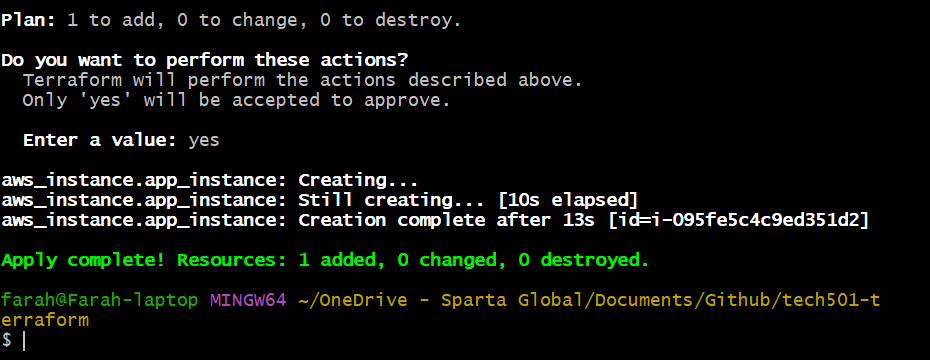
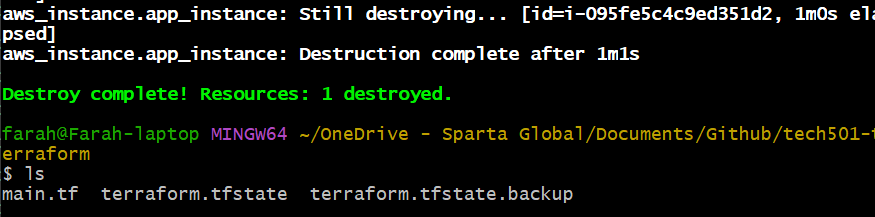

# General steps when using Terraform

- [General steps when using Terraform](#general-steps-when-using-terraform)
  - [Steps](#steps)
  - [Helpful links](#helpful-links)

## Steps

1. create repo for terraform
2.  `terraform init` in the right folder (i.e. our repo that contains our main.tf file)
3.  `terraform validate` to validate the syntax of our .tf files
4. `terraform fmt` to standardise our text format and `terraform plan` to generate a plan (note that we haven't saved this)

1. the destructive command `terraform apply` and `yes` to create everything

   - Success:
    
1. the destructive command `terraform destroy` and `yes`

   - Success:
     

## Helpful links

- [Template for creating EC2 instances in Terraform](https://github.com/terraform-aws-modules/terraform-aws-ec2-instance)
- [Template for creating AWS security groups in Terraform](https://github.com/terraform-aws-modules/terraform-aws-security-group)
- [Template for creating AWS VPCS i.e. virtual networks in Terraform](https://github.com/terraform-aws-modules/terraform-aws-vpc)
- [More templates for creating AWS resources in modular format in Terraform](https://github.com/terraform-aws-modules)