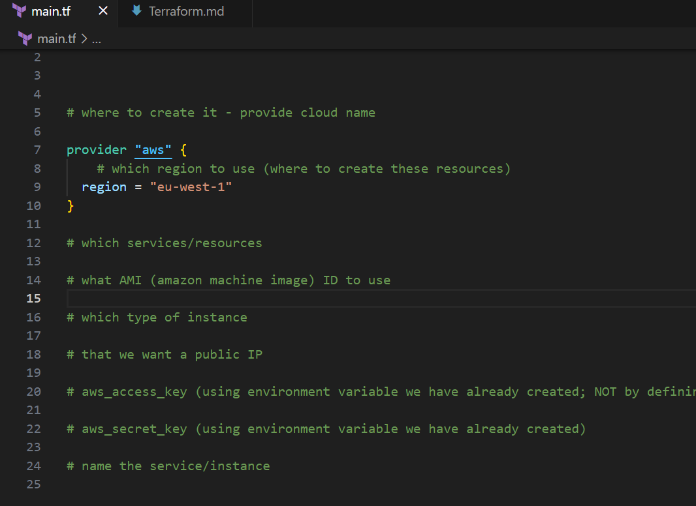
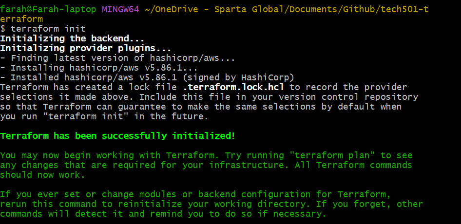

# Terraform notes

- [Terraform notes](#terraform-notes)
  - [High-level steps of what we did on Tuesday](#high-level-steps-of-what-we-did-on-tuesday)
  - [Installing Terraform on Windows](#installing-terraform-on-windows)
  - [Storing our AWS access keys as environment variables](#storing-our-aws-access-keys-as-environment-variables)
  - [Infrastructure as code](#infrastructure-as-code)
  - [What is Terraform? What is it used for?](#what-is-terraform-what-is-it-used-for)
  - [Why use Terraform? The benefits?](#why-use-terraform-the-benefits)
  - [Alternatives to Terraform](#alternatives-to-terraform)
  - [How does Terraform work?](#how-does-terraform-work)
    - [Terraform code](#terraform-code)
  - [In IaC, what is orchestration? How does Terraform act as "orchestrator"?](#in-iac-what-is-orchestration-how-does-terraform-act-as-orchestrator)
  - [Best practice supplying AWS credentials to Terraform](#best-practice-supplying-aws-credentials-to-terraform)
  - [If Terraform needs AWS access, there are different options on supplying the AWS credentials to Terraform. What is order in which Terraform looks up AWS credentials (which ways take precedence/priority)?](#if-terraform-needs-aws-access-there-are-different-options-on-supplying-the-aws-credentials-to-terraform-what-is-order-in-which-terraform-looks-up-aws-credentials-which-ways-take-precedencepriority)
  - [Terraform modules](#terraform-modules)
  - [Helpful links](#helpful-links)

## High-level steps of what we did on Tuesday

1. Installed Terraform
2. Added AWS ID and key to system environment variables
3. Created folder for this project and a *main.tf* file to define our EC2 instance (*~/OneDrive - Sparta Global/Documents/Github/tech501-terraform/create-ec2-instance*)
4. ran Terraform commands to create and destroy EC2 instance (see [here](<Terraform steps.md>))
5. Initialised this folder as a Git repo:
   1. `git init`
   2. `git branch -M main`
6. Created `.gitignore` file in this repo with `.terraform/`, and `terraform.tfstate`, `terraform.tfstate.backup` inside
7. Ran `git status` to ensure these weren't being tracked; also ran `git add .` and then `git status` to confirm this
8. Created AWS security group using Terraform (in *security_groups.tf*) and modified the *main.tf* file we created earlier

## Installing Terraform on Windows

1. Download the Terraform zip folder from the [Hashicorp site](https://developer.hashicorp.com/terraform/tutorials/aws-get-started/install-cli)
2. Unzip it
3. Run `echo $PATH` to see where PATH folders are
4. Move the unzipped folder from Downloads to one of these PATH folders
5. Verify the installation with `terraform -help`
6. Ensure we can run `terraform` commands from anywhere in Git Bash
- Output of `terraform --version`:
  - Terraform v1.10.5 on windows_amd64
 
## Storing our AWS access keys as environment variables 

1. Windows key + R
2. Run `sysdm.cpl`
3. Navigate to **Advanced tab** > **Environment Variables** > in the **System variables** tab, click **New** and use *AWS_ACCESS_KEY_ID* and *AWS_SECRET_ACCESS_KEY* as the IDs, with their **values** (in secure .csv file) stored as their values > click OK
4. In Git Bash, run

## Infrastructure as code

- **IaC**: provisioning infrastructure via code, not GUIs
- **declarative IaC**: users define the desired end state/result, and the tool handles how to get there (e.g. Terraform)
- **imperative IaC**: users specify the exact steps taken (e.g. Ansible)
- **idempotent**: when it doesn't matter how many times you run a script, the tool will make sure that the desired state will always e reached (e.g. running a script twice won't result in 2 results) 
- infrastructure has dependencies -- certain things need to be created first before others can be
- two types of IaC tools:
  - configuration management tool, e.g. Ansible
  - orchestration tool, e.g. Terraform
- IaC tools like Ansible can prevent configuration drift by specifying the configuration you want
- **configuration drift**:
  - when you have an ecosystem like multiple servers running under a load balancer, and all of the servers should be configured the same
  - if someone logs into one and modifies the setting on one, this results in configuration drift between the servers
  - this becomes an issue when, e.g., you have to migrate them all to the cloud and you have to work out which server has the ideal configuration

## What is Terraform? What is it used for?

- IaC tool used to orchestrate (i.e. lifecycle management of the resources in infrastructure)
- uses Hashicorp language
- Terraform views infratscuture as imutable and therefore disposable -- i.e. it will destroy rebuild something if you want to modify it
- In contrast, configuration management tools like Ansible will modify what's already there because they view existing infrastructure as mutable
- Configuration management tools like Ansible are less good at orchestration because they're not designed for orchestration

## Why use Terraform? The benefits?

- opensource
- efficient and scalable

## Alternatives to Terraform

- Pulumi
- AWS CloudFormation
- OpenTofu

## How does Terraform work?

- Terraform needs the credentials for your cloud provider (these are always called the same thing, according to the provider's )
- Terraform code is stored in files like:
  - *main.tf* (*.tf*=terraform file) files
  - *variables.tf*
  - we will use these above two
  - you also might have *networking.tf* or *provider.tf*
  - note that *terraform.tfstate* and its backup file **must be git ignored** because they contain sensitive information
  - note that the names of .tf files can be anything; terraform will look at all files ending in .tf

### Terraform code 
  - `terraform init` -- initialises terraform in a given folder; this will automatically download what is needed for your given provider
    - i.e. even when my terraform main.tf looked like this, the output of `terraform init` already references AWS because it has been specified in *main.tf*

  - also note that the `.terraform.lock.hcl` file CAN be shared because it locks the versions of the plugins being used; this is important to share with team working on the same project because they may use later versions of the plugin which could break the code
  - `terraform plan` -- get a plan of what terraform is going to do to get things into a desired state based on how we've coded the infrastructure in our files # note that this can be saved to be specified in next command
  - `terraform apply` -- (destructive i.e. dangerous command)
  - `terraform destroy` -- (destructive command) gets rid of the resources it has created and is managing (i.e. everything we've defined in our code and created using `terraform apply`)
  - `terraform fmt` -- turns all .tf files into standard format (i.e. standard indentation, spacing)
  - `terraform validate` -- validates syntax
- when creating/managing something via terraform, it's best practice to include terraform in the name e.g. *tech501-farah-terraform-app* so it's clear what created/is managing it

## In IaC, what is orchestration? How does Terraform act as "orchestrator"?

- As an orchestration tool, Terraform works out what needs to be created first in infrastructure setup and does this in the right order (same with deleting)
- This means it's **orchestrating** the entire lifecycle of the resources
- if one element has been modified, Terraform often needs to destroy the infrastructure and build it again to ensure it's all harmonised 

## Best practice supplying AWS credentials to Terraform

- as environment variables

## If Terraform needs AWS access, there are different options on supplying the AWS credentials to Terraform. What is order in which Terraform looks up AWS credentials (which ways take precedence/priority)?

1. environment variables (e.g. cloud provider has a standard ID and Key name so Terraform knows how to look it up; thr AWS plugin Terraform uses knows what this is so it will look it up; note that these required variable names etc. may change with updates of versions)
2. Terraform variables
3. AWS shared credentials file
4. IAM role (Identity Access Management role; an AWS role that temporarily grants permissions to a user -- distinct from an IAM user, who has these permissions permanently)

## Terraform modules

- **module**: a collection of Terraform files in a folder
- **root module**: the directory containing the grouped Terraform files that you're running your commands against
- **child module**:
- **variables**: input
- **data source**: external information referenced/looked up in a Terraform file; notated with `data` as the first block(s) following the `provider` block  

## Helpful links

- [Terraform official documentation](http://developer.hashicorp.com/terraform)
- [Windows tool for creating Azure instances using Linux](https://learn.microsoft.com/en-us/azure/virtual-machines/linux/quick-create-terraform?tabs=azure-cli); note that HC documentation is preferable because they updated their syntax often and this isn't always reflected in third-party resources
- [Template for creating EC2 instances in Terraform](https://github.com/terraform-aws-modules/terraform-aws-ec2-instance)
- [Template for creating AWS security groups in Terraform](https://github.com/terraform-aws-modules/terraform-aws-security-group)
- [Template for creating AWS VPCS i.e. virtual networks in Terraform](https://github.com/terraform-aws-modules/terraform-aws-vpc)
- [More templates for creating AWS resources in modular format in Terraform](https://github.com/terraform-aws-modules)
