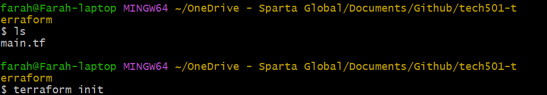
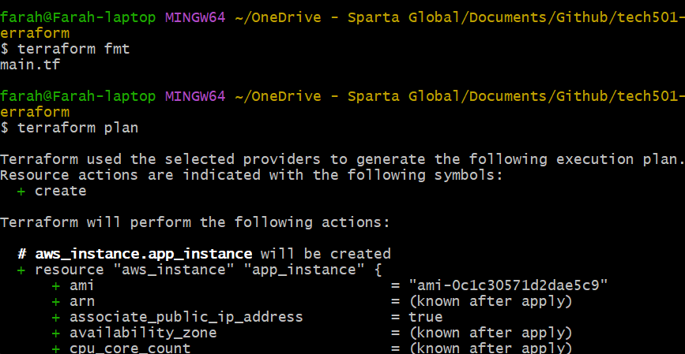
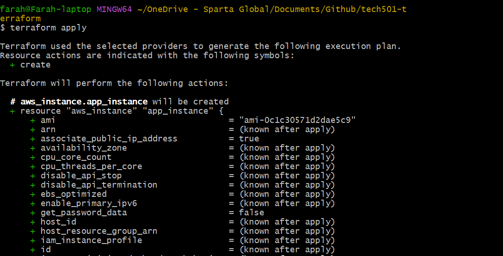
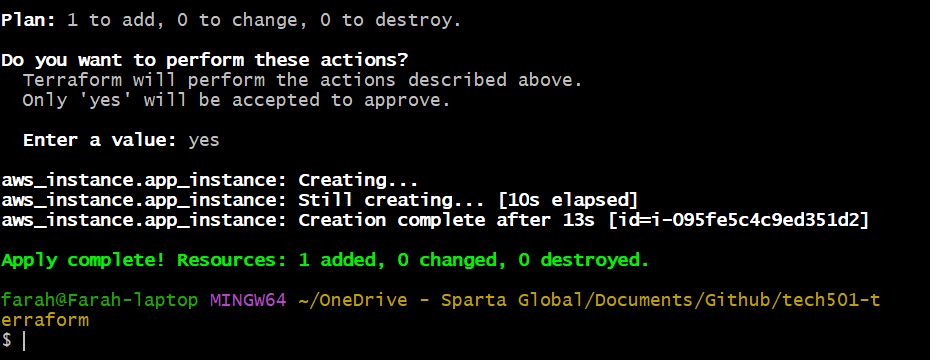
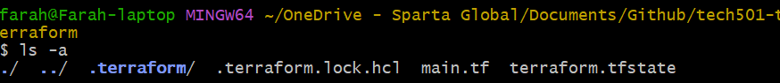
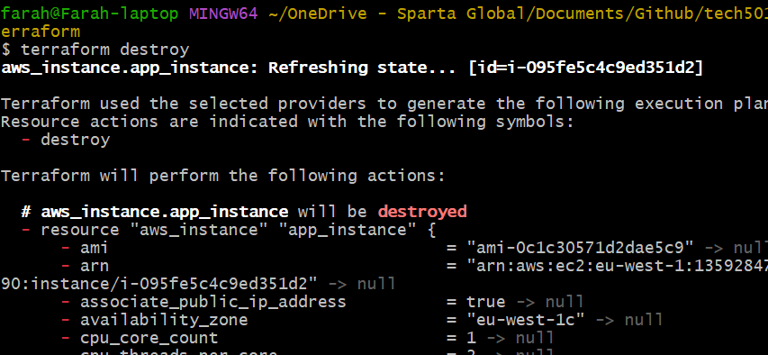
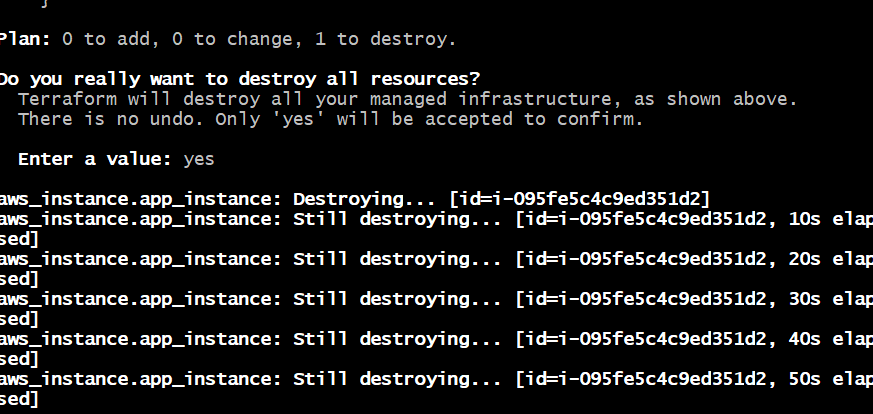
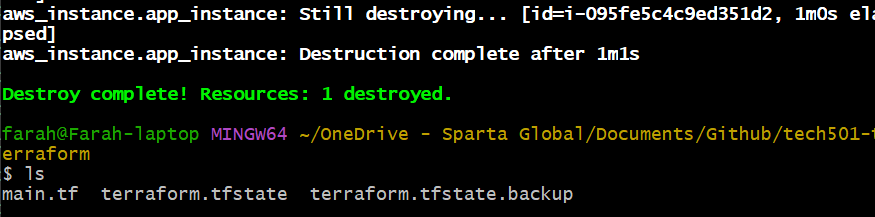

1. create repo for terraform
2.  `terraform init` in the right folder (i.e. our repo that contains our main.tf file)
3. `terraform fmt` to standardise our text format and `terraform plan` to generate a plan (note that we haven't saved this)

4. the destructive command `terraform apply` and `yes` to create everything

   - Success:
    
1. the destructive command `terraform destroy` and `yes`

   - Success:
     