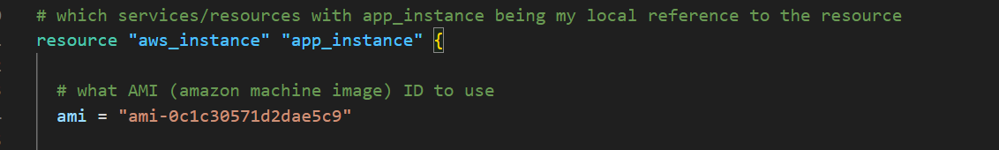
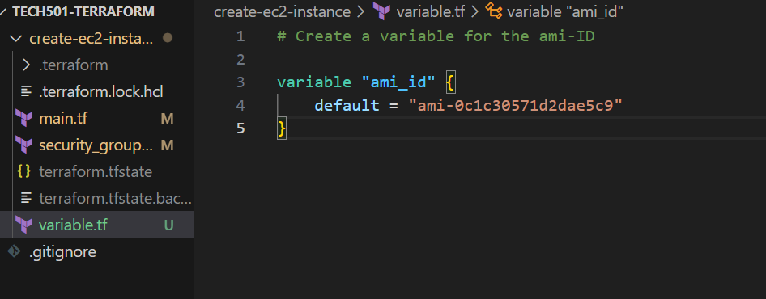
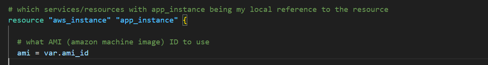

# Variables in Terraform

## Why use them?

- DRY: don't repeat yourself principle
- Abstraction: removes some of the detail from our code to reduce its complexity, allowing other people to understand it easily
- If we have to change a variable, we only have to change it one location (the variable definition)
- Security: we don't have to hard code potentially sensitive information (e.g. environment variables like our AWS access keys) in the .tf files we share to GitHub; instead, we can add them to a file and add this to out .gitignore file

## Variable file (to be git ignored)

- **This absolutely needs to be added to our *.gitignore* file**
- This can be named *.tfvars* and Terraform will recognise it as a variables file
- For our purposes, we're just going to keep it simple and create a *variable.tf* file
- example of using a variable for the AMI ID value
  - **before**:
  - 
  - **after**:
    
    